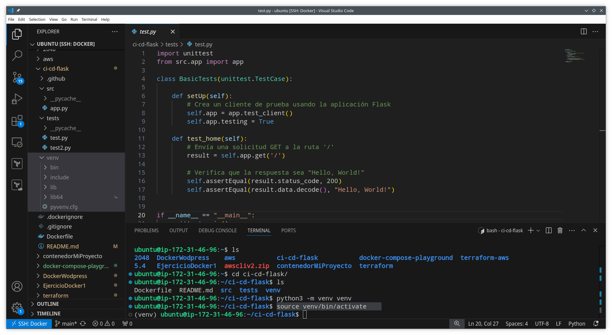

# Ejercicio ci-cd-flask

En esta practica haremos una integracion y un desliegue continuo y haremos una serie de test sobre un archivo app.py, para ello he hecho un fork al siguiente repositorio https://github.com/josejuansanchez/ci-cd-flask, en este están los archivos necesarios para realizar la integracion y el desliegue continuo para una aplicación Flask.

Lo primero que haremos será crear un entorno virtual en Python, escribiremos el comando: 

```
python3 -m venv venv
```


Si miramos a nuestros archivos veremos que se ha creado el directorio venv con los archivos necesarios para usar el entorno virtual 


Después activamos el entorno virtual, para ello usamos el comando

```
source venv/bin/activate
```



UNa vez hecho esto instalaremos las dependencias, en esta practica hemos hecho uso de un archivo txt llamado requirements.txt para la instalacion de las dependencias para nuestra aplicación, en este caso instalaremos flask, necesitamos poner "Flask" en el archivo  


Y con el enbtorno virtual activado instalaremos las dependencias escritas en el archivo requirements.txt con el comando:  

```
pip install -r requirements.txt
```

    

Se instalaren las dependencias  

  

Ahora haremos los tests, los tests nos ayudan testear si hay errores evitando el despliegue de la aplicacion si hay errores. En el repositorio al que le he hecho un fork hay un archivo app.py y un test.py, en app.py al dirigirnos a la ruta principal "/" nos tiene que devolver "Hello, world!", test.py verifica que el resultado que devuelve esa ruta sea "Hello, world!". 
Para esta prueba he hecho dos cosas, me he creado un segundo archivo test2.py donde estoy comprobando que la ruta "/" devuelve "Hola mundo, esto es una prueva", lo mismo he hecho en test.py, si todo va bien debería devolverme un mensaje de error ya que la ruta "/" no devuelve el mismo mensaje que se están comparando en los tests.

  
  

Acontinuación ejecitamos los test con el entorno virtual activo, usaremos el comando:  

```
python3 -m unittest tests/*.py
```
Y exactamente me da dos mensajes de error porque en ambos tests estoy poniendo un mensaje distinto al que devuelve "/" 


  

En cambio si en ambos tests ponemos el mismo mensaje "Hello, world!" que devuelve la ruta "/" al hacer la comparacion en los dos tests devería devolver un mensaje de "OK"  

  

AHora haregos un git push para que se realicen las actiones en github y suba el dockerfile a nuestro dockerhub, para ello desactivaremos el entorno virtual con el comando:   

```
deactivate
```
(la siguiente imagen la realicé cuando estaba creando requeriments.txt, fijate en la terminal para ver lo que ocurre al usar el comando)

  

Pero en github necesitaremos generar tockens en dockerhub y asocuarlas en nuestro repositorio github, para ello nos dirigimos a nuestro repositorio, pulsamos en settings despues en Security seleccionaremos secretis and variables donde encontraremos la seccion envioriment secrets, le pulsamos a new reposity secrets donde escribiremos un nombre de variable y un secreto, en este caso crearemos dos nombres de variables. Me he valido de la practica 2048 para explicar cómo es este proceso (ya que en su momento se me olvidó hacer capturas de este proceso pero en esta practica), los pasos son exactamente los mismos.

  

Los siguientes pasos que daremos será irnos a dockerhub y dirigirnos a la configuración del perfil, seleccionamos la opcion personal access tockens y luego le damos al boton azul generate new tocken  


  
  
   

aqui le daremos una descripcion al tocken, le pondremos que no tiene fecha de caducidad y sobretodo le daremos permisos de lecturta, escritura y eliminacion

  

Entonces nos dará dos comandos, el primero el login de docker con nuestro nombre de usuario donde solo copiaremos el nombre de usuario y una contraseña para acceder al tocken  

  

Entonces en github nos crearemos una variable DOCKERHUB_USERNAME cullo secreto será el nombre de usuario generado en tel tocken de dockerhub y crearemos otro secreto mas que lo llamaremos DOCKERHUB_TOKEN cullo secreto será la clave generada en el token de en dockerhub  

 
 


En el repositorio al que le he hecho un fork ta venia la configuracion del workflow por lo que no lo he tenido que crear yo.  
Al hacer un push las aciones de github se pondrán en ejecucion los workflows, si el simbolo naranja se vuelve verde sigmifica que se realizó la ejecución correctamente, si se pone rojo significa que hubo un fallo  


  

  


Y el dockerfile se subirá a nuestro dockerhub  

   
  
