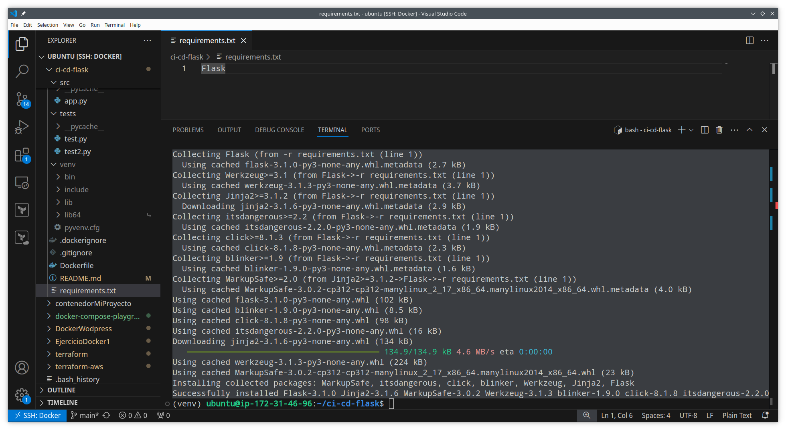

# Ejercicio ci-cd-flask

En esta practica haremos una integracion y un desliegue continuo y haremos una serie de test sobre un archivo app.py, para ello he hecho un fork al repositorio, en este están los archivos necesarios para realizar la integracion y el desliegue continuo para una aplicación Flask.

Lo primero que haremos será crear un entorno virtual en Python, escribiremos el comando: 

```
python3 -m venv venv
```


Si miramos a nuestros archivos veremos que se ha creado el directorio venv con los archivos necesarios para usar el entorno virtual 


Después activamos el entorno virtual, para ello usamos el comando

```
source venv/bin/activate
```


UNa vez hecho esto instalaremos las dependencias, en esta practica hemos hecho uso de un archivo txt llamado requirements.txt para la instalacion de las dependencias para nuestra aplicación, en este caso instalaremos flask, necesitamos poner "Flask" en el archivo  


Y con el enbtorno virtual activado instalaremos las dependencias escritas en el archivo requirements.txt con el comando:  

```
pip install -r requirements.txt
```

    

Se instalaren las dependencias  

  

Ahora haremos los tests, los tests nos ayudan testear si hay errores evitando el despliegue de la aplicacion si hay errores. En el repositorio al que le he hecho un fork hay un archivo app.py y un test.py, en app.py al dirigirnos a la ruta principal "/" nos tiene que devolver "Hello, world!", test.py verifica que el resultado que devuelve esa ruta sea "Hello, world!". 
Para esta prueba he hecho dos cosas, me he creado un segundo archivo test2.py donde estoy comprobando que la ruta "/" devuelve "Hola mundo, esto es una prueva", lo mismo he hecho en test.py, si todo va bien debería devolverme un mensaje de error ya que la ruta "/" no devuelve el mismo mensaje que se están comparando en los tests.

  
  

Acontinuación ejecitamos los test con el entorno virtual activo, usaremos el comando:  

```
python3 -m unittest tests/*.py
```
Y exactamente me da dos mensajes de error porque en ambos tests estoy poniendo un mensaje distinto al que devuelve "/" 


  

En cambio si en ambos tests ponemos el mismo mensaje "Hello, world!" que devuelve la ruta "/" al hacer la comparacion en los dos tests devería devolver un mensaje de "OK"  

  

AHora haregos un git push para que se realicen las actiones en github y suba el dockerfile a nuestro dockerhub, para ello desactivaremos el entorno virtual con el comando:   

```
deactivate
```
(la siguiente imagen la realicé cuando estaba creando requeriments.txt, fijate en la terminal para ver lo que ocurre al usar el comando)

  

Al hacer un push las aciones de github se pondrán en ejecucion los workflows, si el simbolo naranja se vuelve verde sigmifica que se realizó la ejecución correctamente, si se pone rojo significa que hubo un fallo  


  

  

